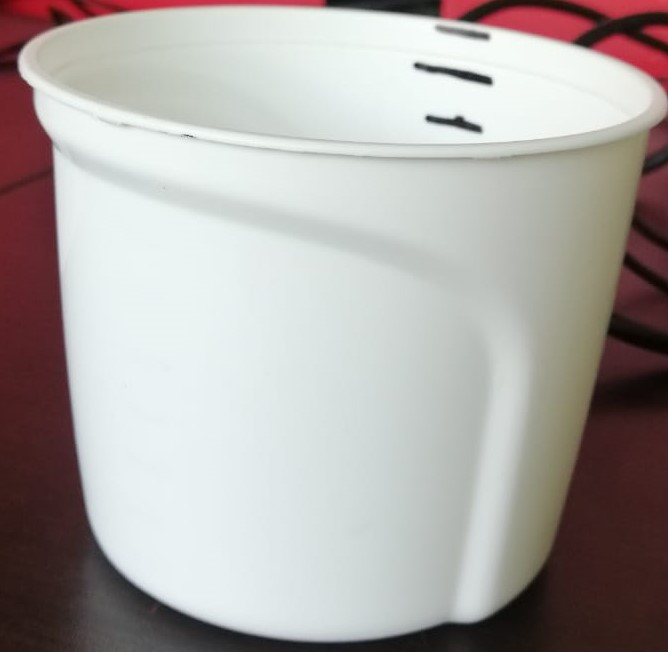

<h1 align="center">Camara: TOF</h1>

 

Demo medicion de volumen

 

 

 Acontinuacion se presenta un demo para el calculo del volumen que se encuentra en el interior de un recipiente en el laboratorio, ver figura (1). Para esta ocasión, se uso una mezcla de agua con una arcilla simulando  un lodo con el fin de tener de manera general  las condiciones del material a inspeccionar en mineros y calcular el volumen.
 

Figura 1.

Requerimientos:

Este demo se realizo en Python 3.10.7, ademas, es necesario contar con las librerias que se encuentra en el archivo solucion Leer_archivo_h5 de este repocitorio.

En el laboratorio se obtuvieron imagenes del tarro con diferentes volumenes de la mezcla, la cual se fué adicionando en el tarro a alturas aproximadas de 2,4,6 y 8 centrimetros usando el archivo "capturas_h5.py".

PROCEDIMIENTO PARA EL CALCULO DEL VOLUMEN

El procedimiento para realizar la medicion esta dada por:

*Cargar datos de las imagenes (nube de puntos)

*Guardar la informacion de la imagen de referencia. Figura 2.

*A las imagenes del recipiente con cada volumen segmentar la superficie del volumen. Figura 3

 *Unir la superfice segmentada en la imagen de referencia. Figura 4. 

*Segmentar la region que contiene el volumen en la imagen unida para extraer el volumen del recipiente contenido. Figura 5.

*Realizar un mesh por medio de delaunay 3D para rellenar la seccion segmentada.

*Optener el valor del Volumen.

Imagen del volumen solido.
 

